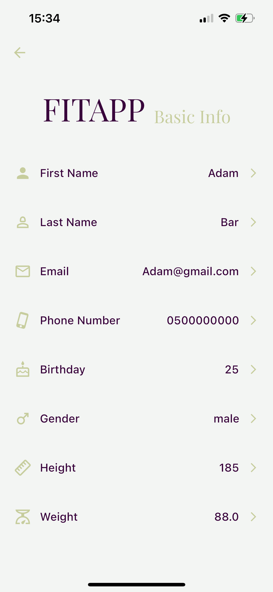

# FitApp

Welcome to the repository for FitApp, a comprehensive fitness application designed to enhance and personalize your health journey. Leveraging Flutter for cross-platform functionality, FitApp integrates a suite of features to provide a seamless and intuitive user experience. This README offers a detailed look into the application's architecture, key features, and the innovative integration of a machine learning algorithm for predictive weight management.

  
  
  
  

  
  
  
  

  
  
  
  

## Key Features

### Personalized User Experience
- **Customizable Settings Screens**: Manage and edit all your personal details through an intuitive settings interface, ensuring your FitApp experience is uniquely yours.
- **Progress Tracking and Metrics**: Easily update and view your progress with well designed tables and metrics. Access your entire record history in a user-friendly and accessible format.

### Nutrition and Fitness Goals
- **Editable Nutritional Goals**: Set and visualize your nutritional objectives with clear, graphical representations, tailored by certified coaches to fit your personal needs.
- **Customized Workout Plans**: Build your personalized workout plan from an extensive library of exercises, with flexible settings for repetitions and sets, ensuring a tailored fitness experience.

### Notifications and Reminders
- **Custom Alerts for Updates**: Stay on track with personalized notifications, such as weekly weigh-in reminders, displayed seamlessly within your iPhone's notification screen.

### Advanced Tracking and Predictive Analytics
- **Metrics Dashboard**: View your fitness journey's progress through a comprehensive metrics screen, including navigation to advanced progress graphs, weight update history, and overall metrics.
- **Predictive Weight Management**: Leverage our machine learning algorithm for future weight prediction, integrating your user progress history and current goals to offer insightful forecasts for the coming week.

### Workout Experience
- **Interactive Training Programs**: Enjoy a seamless view of all your training programs, complete with GIF images demonstrating how to accurately perform each exercise, making your workout experience engaging and effective.

## Architecture Overview

FitApp utilizes the BloC (Business Logic Component) design pattern, drawing inspiration from the MVVM (Model-View-ViewModel) architecture. This approach ensures a robust separation of concerns, facilitating a scalable and maintainable codebase. It emphasizes efficient state management and reactivity, essential for a dynamic and engaging user interface.

## Client-Side Development

Choosing Flutter for FitApp enables cross-platform accessibility, ensuring the app is available on iOS, Android, web, and desktop. Crafted with Dart and the Flutter library, FitApp's client side delivers a unified and high-quality experience across diverse devices and platforms, emphasizing wide accessibility and consistency.

## Backend Structure

The backend, written in Dart, manages the app's data models and entities, interfacing with Firebase for real-time data synchronization and storage. It efficiently handles user data, ensuring seamless experiences across all features of the app, including user progress tracking and customization of fitness plans.

## Database

Firebase serves as the database solution for FitApp, chosen for its real-time data handling and seamless integration with Flutter. This combination ensures a responsive and scalable backend, supporting the dynamic data needs of a fitness application.

## Backend and Machine Learning Integration

While the core backend of FitApp is developed in Dart, a significant enhancement comes from its integration with a machine learning algorithm hosted on a separate server. This server, utilizing the Python Flask library, communicates with the Flutter app through a dedicated API using HTTP requests. This architecture allows for advanced predictive analytics without burdening the mobile app's performance.

### Machine Learning Algorithm

The machine learning component employs linear regression to predict the user's weight for the next week, based on their recorded progress, body measurements, and current goals. This predictive feature is designed to motivate users by providing personalized insights and goals, enhancing the app's utility.

## App Promo

---

Created and developed by Bar Tawil.
